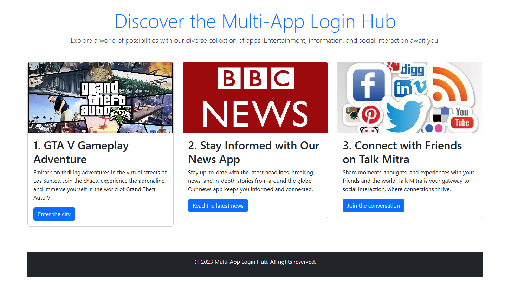

# Multi-App Login Hub

Seamlessly Access Multiple Apps with a Single Login



## Deployment

To deploy this project run
```node

  npm start

```


## Tech Stack

1. **Frontend Framework**:
   - **React**: A popular JavaScript library for building user interfaces. It's efficient for creating interactive and responsive web applications.

2. **Backend Framework**:
  **Node.js and Hapi Js**: A runtime environment for executing JavaScript on the server side. It's commonly used with Express.js to create RESTful APIs and handle backend logic.

3. **Database**:
   - **PostgreSQL**: Traditional relational databases may be necessary for certain data storage needs, especially if you have complex data relationships.

4. **API Documentation**:
   - **Swagger**: These tools allow you to define, document, and test your API endpoints, making it easier for other developers to integrate with your service.

5. **UI Components**:
   - **Bootstrap**: These UI component libraries provide pre-designed elements that can speed up frontend development.

6. **Version Control**:
    - **Git**: The industry-standard for version control, which is essential for collaborating on code.

7. **Deployment and Hosting**:
    - **Netlify or Vercel**: Great options for hosting static sites or single-page applications.

## Contributors

- Prashant Deshmukh
- Amit Kumar
- Puran Lohar
- Aadarsh Kumar

